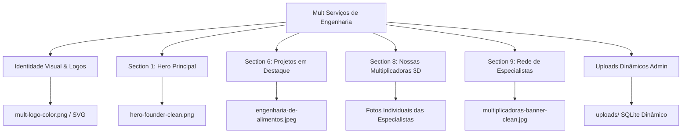
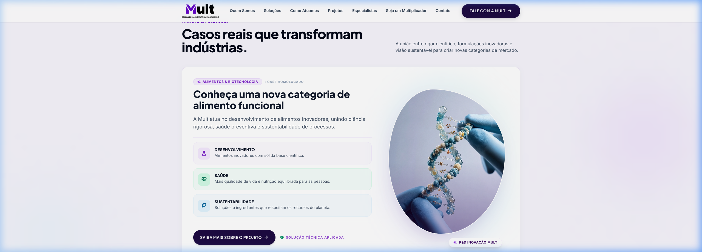
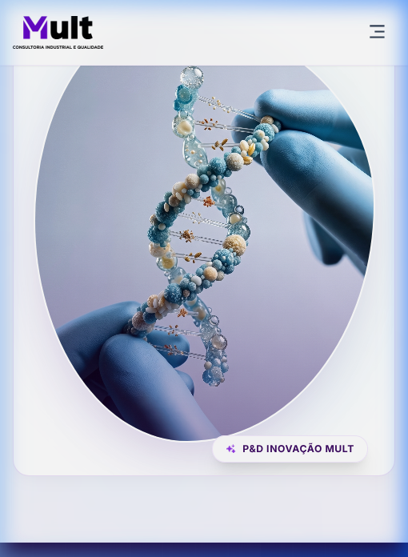
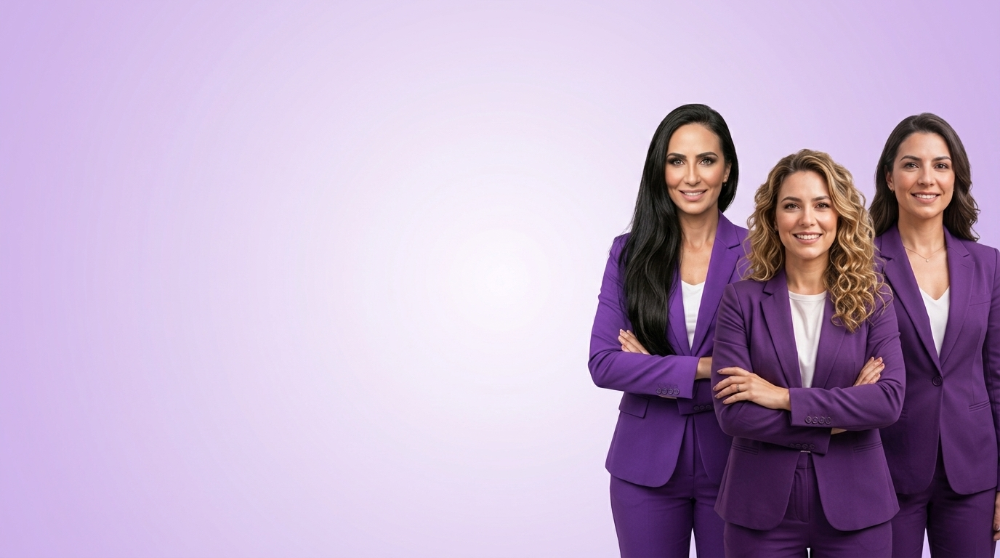

# Guia de Especificação & Inventário de Ativos Visuais
### Site Institucional Mult Serviços de Engenharia

> [!IMPORTANT]
> Este documento técnico consolida o inventário de **todas as imagens** da aplicação, seus locais físicos, funções na interface e diretrizes estritas de dimensionamento responsivo para **Desktop**, **Tablet** e **Mobile**.

---

## 1. Mapeamento dos Ativos Visuais Ativos em Produção

---

## 2. Inventário Detalhado por Seção & Especificação por Dispositivo

### 2.1 Identidade Visual, Logotipos e Ícones

* **Localização Principal:** [`assets/logo/`](assets/logo/)
* **Arquivos-Chave:**
  * [`assets/logo/mult-logo-color.png`](assets/logo/mult-logo-color.png) (3600 × 1299 px, 92 KB)
  * [`assets/logo/mult-logo.svg`](assets/logo/mult-logo.svg) (16.9 KB, Vetorial Puro)
  * [`assets/logo/mult-logo-white.png`](assets/logo/mult-logo-white.png) (3600 × 1299 px, 64 KB)
  * [`assets/logo/mult-icon-color.png`](assets/logo/mult-icon-color.png) (1760 × 1658 px, 35 KB)
  * [`assets/logo/favicon.png`](assets/logo/favicon.png) (64 × 60 px) & [`assets/logo/favicon-32x32.png`](assets/logo/favicon-32x32.png) (32 × 32 px)

#### Diretrizes Técnicas por Dispositivo:
| Dispositivo | Dimensão de Renderização | Resolução de Exportação | Formato | Limite de Peso |
| :--- | :---: | :---: | :---: | :---: |
| **Desktop (≥ 1024px)** | Altura fixa `40px` (largura proporcional ~140px) | Vetorial Puro ou `280 × 80 px @2x` | **SVG** (ou PNG 24-bit) | < 20 KB |
| **Tablet (768px - 1023px)**| Altura fixa `36px` | Vetorial Puro ou `240 × 72 px @2x` | **SVG** | < 20 KB |
| **Mobile (< 768px)** | Altura fixa `32px` | Vetorial Puro ou `200 × 64 px @2x` | **SVG** | < 15 KB |

> [!TIP]
> **Recomendação de Performance:** O uso de [`assets/logo/mult-logo.svg`](assets/logo/mult-logo.svg) no cabeçalho garante renderização perfeita em qualquer densidade de pixels (Retina, 4K) com zero artefatos e carregamento instantâneo.

---

### 2.2 Section Hero: Destaque da Fundadora (`#hero`)

* **Localização Principal:** [`assets/img/hero-founder-clean.png`](assets/img/hero-founder-clean.png)
* **Dimensão Atual:** 709 × 379 px (274.4 KB)
* **Arquivos Relacionados:** [`assets/img/hero-moldura-clean.png`](assets/img/hero-moldura-clean.png) (360×190 px), [`assets/img/hero-moldura-clean@2x.png`](assets/img/hero-moldura-clean@2x.png) (720×380 px), [`assets/img/hero-woman-hd.png`](assets/img/hero-woman-hd.png) (480×360 px).
* **Descrição:** Foto institucional recortada da fundadora Taiana Franco (camisa preta com pin da marca), integrada sobre uma moldura curva suave em degradê roxo da Mult.

#### Diretrizes Técnicas por Dispositivo:
* **Desktop (1440p / 1080p):**
  * **Dimensão de Imagem:** `720 × 480 px` (ou `1440 × 960 px @2x`).
  * **Composição:** Fundadora posicionada à direita com olhar orientado para o centro do layout, transmitindo liderança científica e acessibilidade consultiva.
* **Tablet (768p / 1024p):**
  * **Dimensão de Imagem:** `550 × 380 px`.
  * **Composição:** Redução proporcional de escala sem sobrepor os badges de pilares da base do Hero.
* **Mobile (375p / 412p):**
  * **Dimensão de Imagem:** `380 × 280 px` (ou `760 × 560 px @2x`).
  * **Composição:** Enquadramento mais focado no busto/rosto, garantindo legibilidade do logo no peito e mantendo a frase caligráfica visível.
* **Formato Recomendado:** **PNG Transparente otimizado** ou **WebP com Alpha**. Limite de peso: **< 120 KB**.

---

### 2.3 Section Projetos em Destaque: Biotecnologia & Alimentos (`#projetos`)

* **Localização Principal:** [`assets/img/engenharia-de-alimentos.jpeg`](assets/img/engenharia-de-alimentos.jpeg)
* **Dimensão Atual:** 1888 × 2264 px (2.28 MB)
* **Descrição:** Fotografia 3D científica de alto impacto mostrando duas mãos com luvas cirúrgicas manipulando uma fita de DNA composta por bioativos funcionais, cereais e grãos. Renderizada através da **Silhueta Orgânica Fluida** (`shape-mult-organic`), com halo de luz difusa e badge translúcido de P&D.

#### Validação Visual Responsiva:
| Visualização Desktop (>= 1024px) | Visualização Mobile (375 × 812 px) |
| :---: | :---: |
|  |  |

#### Diretrizes Técnicas por Dispositivo:
* **Desktop (≥ 1024px):**
  * **Dimensão Ideal:** `900 × 1100 px` (Proporção vertical `4:5`).
  * **Composição:** Centralização rigorosa da hélice molecular. Ambas as mãos (superior e inferior) devem permanecer desobstruídas para garantir a narrativa visual de precisão técnica.
* **Tablet (768px a 1023px):**
  * **Dimensão Ideal:** `700 × 850 px`.
  * **Composição:** Escala média mantendo proporção com a coluna de pilares (Desenvolvimento, Saúde, Sustentabilidade).
* **Mobile (< 768px):**
  * **Dimensão Ideal:** `420 × 520 px` (ou `840 × 1040 px @2x`).
  * **Composição:** Centralização no eixo vertical do card com `max-w-[340px] aspect-[4/5] mx-auto`. O badge de autoridade flutua no canto inferior direito.
* **Formato Recomendado:** **WebP Progressivo (Qualidade 82-85%)**. Limite de peso: **< 200 KB** (redução de 90% em relação aos 2.28 MB originais).

---

### 2.4 Section Nossas Multiplicadoras: Equipe Técnica (`#equipe`)

* **Localização Principal:** [`assets/img/`](assets/img/) e [`uploads/`](uploads/)
* **Padrão de Visualização:** Carrossel 3D Imersivo (`team3DCarouselContainer`).

| Integrante | Arquivo Atual | Cargo / Especialidade | Dimensão Atual |
| :--- | :--- | :--- | :---: |
| **Taiana Franco** | [`uploads/mult_1789216810361_3s2o81.jpg`](uploads/mult_1789216810361_3s2o81.jpg) | Fundadora & Eng. Química | 1299 × 866 px |
| **Cristina Pereira** | [`assets/img/cristina-pereira.jpg`](assets/img/cristina-pereira.jpg) | Seleção de Especialistas | 400 × 520 px |
| **Juliana Martins** | [`uploads/mult_1789213867150_4zkj2p.png`](uploads/mult_1789213867150_4zkj2p.png) | Construção da Solução | 1536 × 1024 px |
| **Fernanda Alves** | [`assets/img/fernanda-alves.jpg`](assets/img/fernanda-alves.jpg) | Meio Ambiente & ESG | 400 × 520 px |
| **Renata Souza** | [`assets/img/renata-souza.jpg`](assets/img/renata-souza.jpg) | SST & Gestão de Riscos | 400 × 520 px |
| **Carla Mendes** | [`assets/img/carla-mendes.jpg`](assets/img/carla-mendes.jpg) | Tecnologia & Inovação | 400 × 520 px |

#### Diretrizes Técnicas Padronizadas para Especialistas:
* **Proporção Obrigatória:** **`3:4` (Retrato Vertical Estrito)**.
* **Dimensão Padrão Única:** **`500 × 650 px`** (cobre Desktop, Tablet e Mobile com perfeição).
* **Diretriz de Conteúdo:**
  * Enquadramento tipo plano médio fechado (peito, ombros e rosto centralizado).
  * Fundo de estúdio suave em tons neutros (cinza, bege claro ou degradê suave roxo).
  * Iluminação frontal suave, evitando sombras duras nos olhos.
* **Formato:** **WebP**. Limite de peso: **< 45 KB por foto**.

---

### 2.5 Section Rede de Especialistas (`#multiplicador`)

* **Localização Principal:** [`assets/img/multiplicadoras-banner-clean.jpg`](assets/img/multiplicadoras-banner-clean.jpg)
* **Dimensão Atual:** 1376 × 768 px (467.4 KB)
* **Descrição:** Banner panorâmico mostrando mulheres especialistas e cientistas em reunião e laboratório, integrado via CSS com gradiente lateral para a cor institucional da seção (`#E2D3F5`).

#### Diretrizes Técnicas por Dispositivo:
* **Desktop (≥ 1024px):** `1400 × 700 px` (Proporção `2:1`). Ponto focal deslocado para a direita (`object-[78%_center]`).
* **Tablet (768px a 1023px):** `900 × 500 px`. Transição lateral cobrindo 45% do layout.
* **Mobile (< 768px):** `600 × 400 px`. A imagem fica como plano de fundo difuso com gradiente vertical escurecido para não prejudicar a leitura do formulário/chamada.
* **Formato:** **WebP / JPEG Progressivo**. Limite de peso: **< 150 KB**.

---

## 3. Matriz Comparativa Técnica & Especificação Executiva

| Componente | Desktop (1080p / 1440p) | Tablet (768p / 1024p) | Mobile (375p / 412p) | Aspect Ratio | Formato Ideal | Meta de Peso |
| :--- | :---: | :---: | :---: | :---: | :---: | :---: |
| **Logo Principal (Header)** | 280 × 80 px (exibido em 40px alt) | 240 × 72 px | 200 × 64 px (exibido em 32px alt) | Horizontal | **SVG** | < 20 KB |
| **Hero Image (Fundadora)** | 720 × 480 px | 550 × 380 px | 380 × 280 px | ~3:2 | **PNG Transp / WebP** | < 120 KB |
| **Projetos (DNA / Alimentos)** | 900 × 1100 px | 700 × 850 px | 420 × 520 px | 4:5 Vertical | **WebP / JPEG** | < 200 KB |
| **Fotos Equipe (Carrossel 3D)** | 500 × 650 px | 450 × 585 px | 380 × 494 px | 3:4 Retrato | **WebP / JPEG** | < 45 KB |
| **Banner Rede Especialistas** | 1400 × 700 px | 900 × 500 px | 600 × 400 px | 2:1 a 3:2 | **WebP / JPEG** | < 150 KB |
| **Favicon** | 64 × 64 px | 32 × 32 px | 32 × 32 px | 1:1 Quadrado | **PNG / ICO** | < 5 KB |

---

## 4. Acervo de Apoio, Manuais e Histórico de Design

Os seguintes arquivos estão presentes no repositório local e servem como **ativos mestre de criação**, não devendo ser carregados diretamente no front-end em produção:

1. **[`modelo-site.png`](modelo-site.png) (1414 × 2000 px, 1.53 MB):** Maquete visual completa de concepção inicial da página institucional.
2. **[`MULT_PROJETO LP/`](MULT_PROJETO%20LP/) (19 imagens PNG, ~1920 × 1080 px):** Apresentação de slides que guiou a estruturação dos blocos da landing page.
3. **`mult_logo_page-01.png` a `page-10.png` (4500 × 4500 px cada):** Pranchas do manual da marca em ultra-definição para extrações gráficas e impressão.
4. **[`FLYER ADESÃO.jpeg`](FLYER%20ADES%C3%83O.jpeg) (1024 × 1536 px):** Material promocional de adesão e campanha offline.
5. **[`maira zanotto.png`](maira%20zanotto.png) (1470 × 941 px):** Fotografia de especialista em alta definição disponível no banco de talentos para novos módulos.

---

## 5. Recomendações do Protocolo de Otimização

> [!TIP]
> 1. **Implementação de Redimensionamento Automático no Admin (`api/upload.php`):**  
>    Atualmente, uploads de fotos de membros da equipe (ex: `uploads/mult_1789213867150_4zkj2p.png`) podem subir arquivos de até 1.89 MB. Recomenda-se adicionar uma rotina PHP GD para redimensionar automaticamente novos uploads para `800 × 1040 px` e salvá-los compactados.
> 
> 2. **Conversão de `engenharia-de-alimentos.jpeg` para WebP:**  
>    Converter o arquivo de 2.28 MB para WebP com qualidade 85% preservará 100% dos detalhes visuais da fita de DNA e reduzirá o tráfego da página para menos de 220 KB, acelerando o LCP (Largest Contentful Paint) em conexões móveis 4G/5G.
